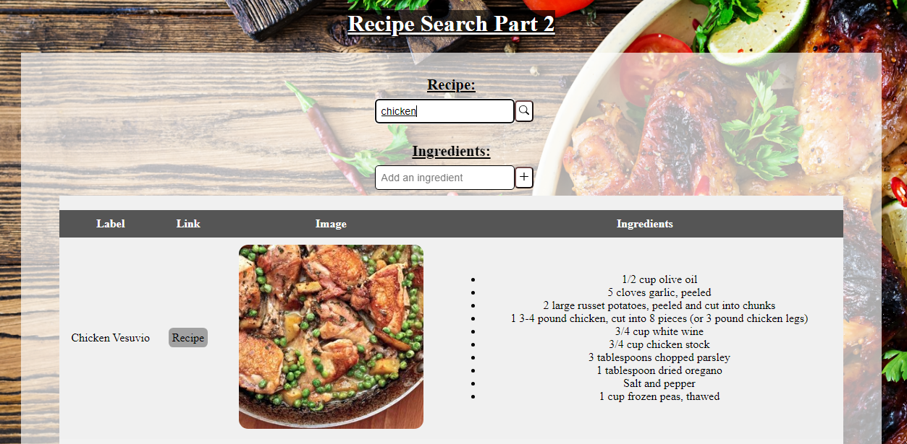

# Project Showcase: `Recipe search`

## Getting Started with the Project
#### 1. To install packages use: `npm install` 
#### 2. Create a `.env` file with:  
##### `REACT_APP_ID=edamamApplicationId`
##### `REACT_APP_KEY=edamamApplicationKeys`
`Note: You have to get the id and keys from:` [Edamam Website](https://developer.edamam.com/admin/applications/1409623118227)
#### 3. run command:   
##### `npm start`

## Overview

The project entails developing a Recipe Search user interface using React and Redux Thunks to manage asynchronous API calls effectively. It includes adding a 'Search' button to initiate recipe searches, utilizing Redux Thunk to access the API asynchronously upon button click. The web application displays each recipe's name, ingredients, and picture in a visually appealing manner once the search results arrive. 

## Technologies Used

- **React:** For building user interfaces, often used for creating dynamic and interactive web applications
- **CSS:** Custom styling for the overall appearance.
- **Redux:** For state management.
- **Jest:** For testing the functionality of the app.

## Contact

For any inquiries or questions, feel free to reach out to Tshediso at [tshedisoboshiana@gmail.com](mailto:tshedisoboshiana@gmail.com).

Other projects can be found at [projects](https://projects-5584f.web.app/)

Happy exploring! 🚀